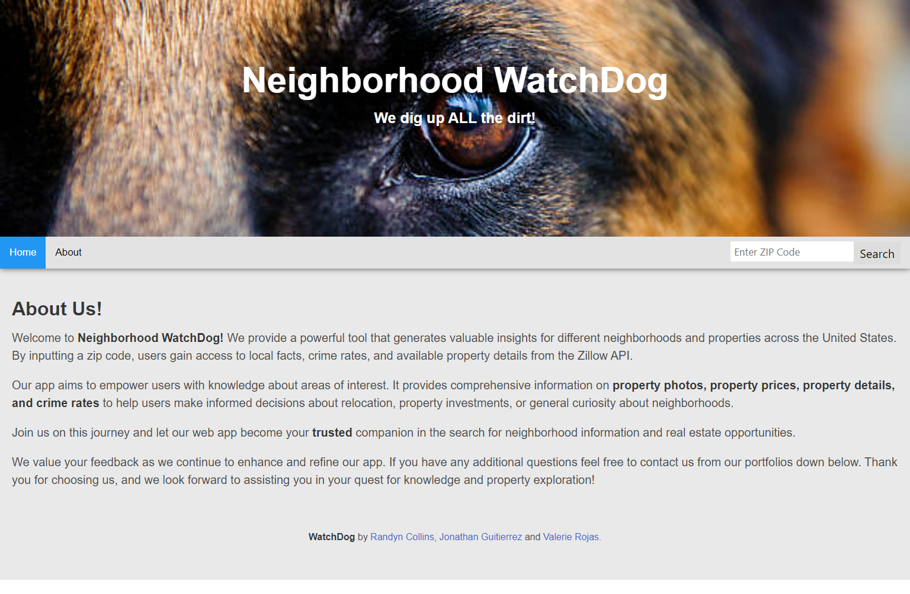
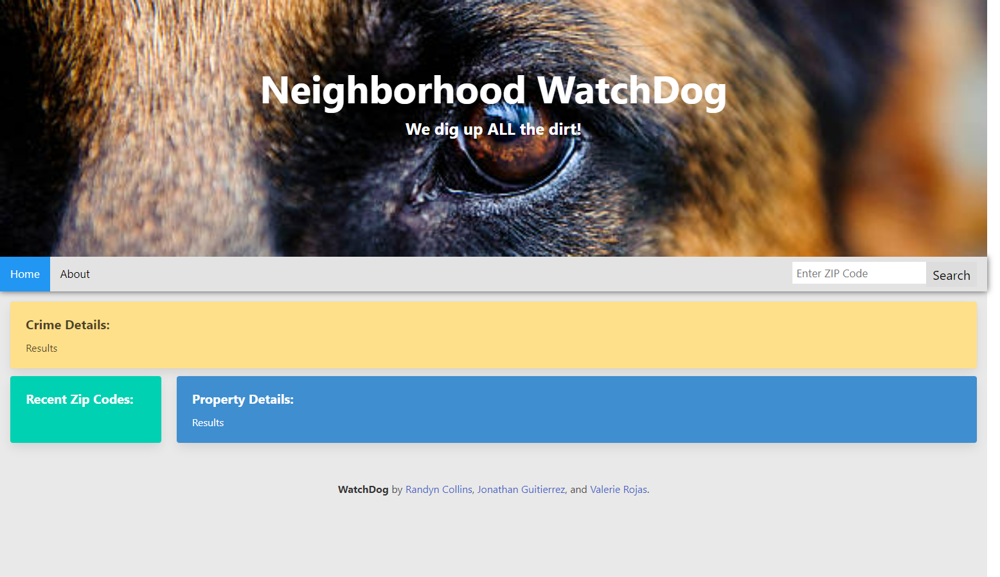

# Project-1-Group-8

## Description

This project was a collaborative effort to put forth a site that would allow the user to search for the crime rate in their zip code area. It was created using JQuery and Bulma CSS Styling, which was still a big learning process for our collective group. We faced multiple challenges throughout this process, but using our combined skills, we were able to work through almost all of the site's issues. Using the combined API's and properly pulling data from each of them using one click event was a trial, as well as showcasing the data pulled. We also had a hard time working with local storage, so the user could pull previous searches information with just a click. We worked through every single problem our site brought us with ease, and together we are proud to say that this safety security site has exceeded our expectations on how far we could go with it. We're still learning, though, so we hope with time, extensive googling, and expertise, we can come back to this project and add on to an already great site. We hope this site help anyone looking for a safer home!

## Usage

To use our site: Click on the empty search bar, input whichever zip code you would like to see the crime rate and zillow options for, then hit enter or click search. The site will post the Crime Breakdown at the top of the page, under the navigation bar. It will also post the zillow listings for available houses in that area. If you would like to search a previous zip code again, simply look toward the Recent Zip Codes column that is holding the previous searches, and click the zip code you would like to see the information for. 

## Credits

Valerie Rojas: https://github.com/Valeriereds

Jonathan Gutierrez: https://github.com/2015johngtz

Randyn Collins: https://github.com/reddot9898

## License

MIT License

Copyright (c) [2023] [ValerieRojas] [RandynCollins] [JonathanGutierrez]

Permission is hereby granted, free of charge, to any person obtaining a copy
of this software and associated documentation files (the "Software"), to deal
in the Software without restriction, including without limitation the rights
to use, copy, modify, merge, publish, distribute, sublicense, and/or sell
copies of the Software, and to permit persons to whom the Software is
furnished to do so, subject to the following conditions:

The above copyright notice and this permission notice shall be included in all
copies or substantial portions of the Software.

THE SOFTWARE IS PROVIDED "AS IS", WITHOUT WARRANTY OF ANY KIND, EXPRESS OR
IMPLIED, INCLUDING BUT NOT LIMITED TO THE WARRANTIES OF MERCHANTABILITY,
FITNESS FOR A PARTICULAR PURPOSE AND NONINFRINGEMENT. IN NO EVENT SHALL THE
AUTHORS OR COPYRIGHT HOLDERS BE LIABLE FOR ANY CLAIM, DAMAGES OR OTHER
LIABILITY, WHETHER IN AN ACTION OF CONTRACT, TORT OR OTHERWISE, ARISING FROM,
OUT OF OR IN CONNECTION WITH THE SOFTWARE OR THE USE OR OTHER DEALINGS IN THE
SOFTWARE.